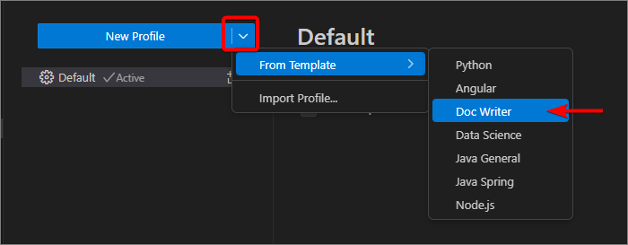
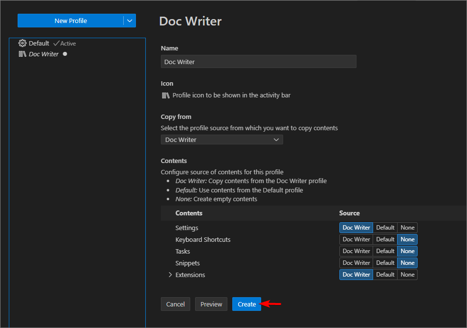
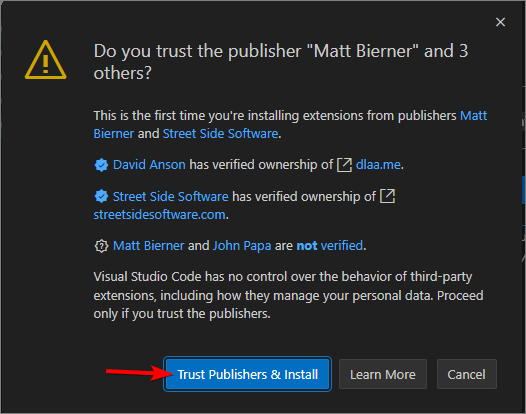
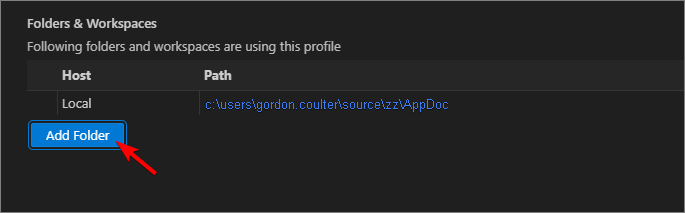
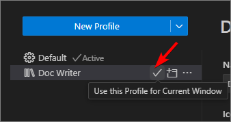
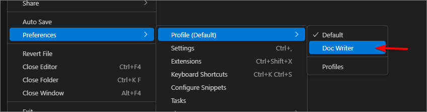

# Configure VS Code

## Overview

We're going to configure VS Code to use the `Doc Writer` profile, which loads a number of extensions and configurations which will assist in creating good markdown.

This includes a **linter** which looks at how you structure your markdown. Pay attention to the wiggles. Hover over them and fix the errors. They can be as simple as having extra spaces at the end of a paragraph, through to badly structured links, or having more than one H1 in your document. If we all follow the guidelines, we end up with great documents.

So let's get started... Go ahead and **Open VS Code**.

## Selecting the Doc Writer profile

Select the menu option: `File -> Preferences -> Profiles`.

Click the down arrow on the `New Profile` button and navigate through `From Template` and select `Doc Writer`.

Click the `Create` button.

Click `Trust Publishers & Install`.

Click `Add Folder` and browse to the App Doc folder you created when doing the Prerequisites configuration.

Activate the profile by clicking the Tick.

You can also switch profiles via the menu `File -> Preferences -> Profiles`

